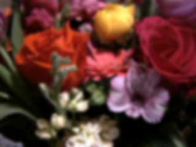
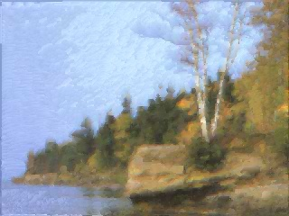
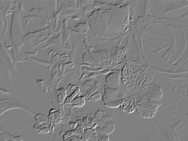
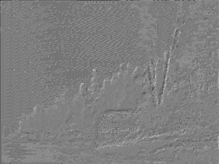
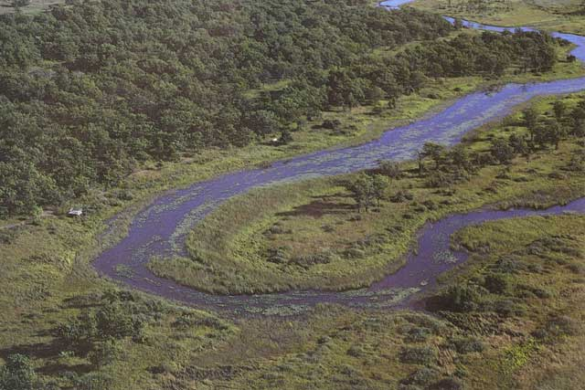
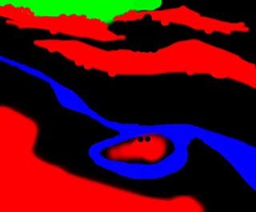
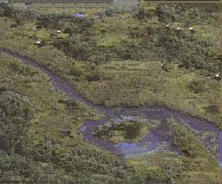
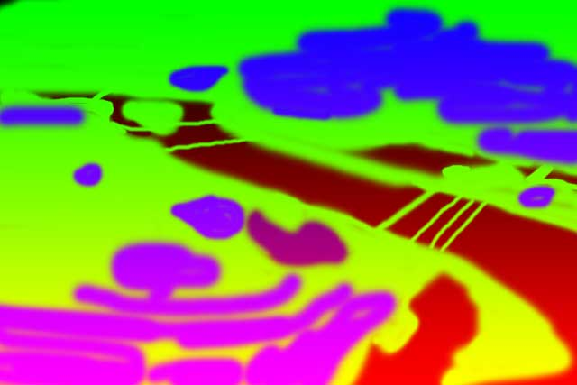
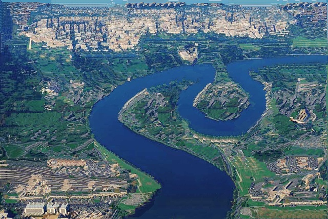

# ImageAnalogy

## Details

- [Image Analogies](https://mrl.nyu.edu/publications/image-analogies/analogies-72dpi.pdf)

## Results

- Blurring

   :  
  
  ::
  
   :  
   
- Embossing

   :  
  
  ::
  
   :  
  
- Texture-by-numbers: Oxbow

   :  
  
  ::
  
   :  
   
- Texture-by-numbers: Potomac

   :  
  
  ::
  
   :  
